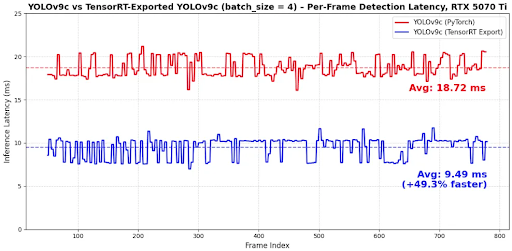
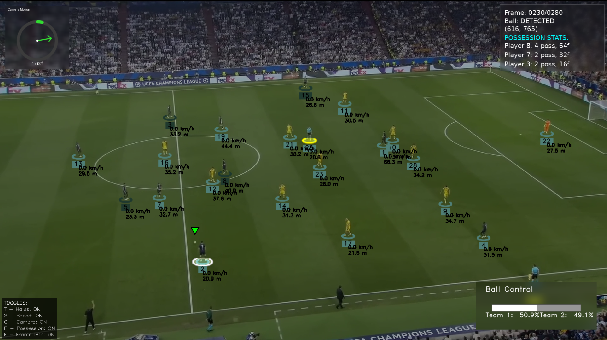

# Sport CV Pipeline — NVIDIA RTX 5070 Ti Showcase

A computer-vision inference stack engineered to saturate the RTX 5070 Ti’s Tensor Cores with real-time sports analytics. 9.49 ms avg forward pass (FP16, batch=4, 1080p). Frame-perfect at 60 FPS input with zero backpressure. HUD overlays benchmarked in OpenCV.

Engineered with NVIDIA to demonstrate the raw throughput of the RTX 5070 Ti. The system blends YOLOv9c detection, ByteTrack association, Kalman‑filter ball estimation, and a suite of domain‑specific analytics (speed & distance, ball possession, team assignment) under a TensorRT‑accelerated inference core.

This pipeline shows that with consumer‑grade GPUs (RTX 5070 Ti), broadcast‑quality multi-object sports analytics can run in real‑time without server‑class hardware. It’s a reference design for edge‑deployed sports AI: modular, deterministic, and optimized.


---
**Testbed**  
- GPU: NVIDIA RTX 5070 Ti (12 GB GDDR7, 17.04 TFLOPs FP16/FP32)  
- Driver: 571.96 (CUDA 12.8)  
- TensorRT: 10.12 GA  
- CPU: AMD Ryzen AI 9 HX 370
- Memory: 32 GB LPDDR5X-8000
- Input: 1080p60 broadcast feed


---
## Features

- **YOLOv9c + ByteTrack + Kalman fusion** – Player/referee detections feed a ByteTrack association pass with tuned thresholds (`track_activation_threshold=0.25`, `lost_track_buffer=30`, `minimum_matching_threshold=0.95`) while a 4‑state Kalman filter interpolates up to 12 missing ball frames  
- **Ball possession acquisition** – Ball is assigned to the nearest player foot if within 70 px, enabling possession stats and HUD callouts  
- **Jersey‑color team clustering** – KMeans on cropped torso patches clusters players into two jersey colors and caches assignments for subsequent frames  
- **Perspective homography + physics metrics** – A pitch‑calibrated homography projects pixel positions to meters; smoothed speed (km/h) and cumulative distance (m) are computed with per‑player histories and sanity checks  
- **Camera motion compensation** – Lucas–Kanade optical flow on masked border features estimates camera translation every N frames, with motion interpolation between calculations  
- **Per‑player possession analytics** – Frame‑level possession streaks and totals are tracked for top‑N leaderboards and overlay stats  
- **Realtime HUD toggles** – Halos, speed/distance, camera motion, ball possession and frame info overlays can be toggled live via keyboard shortcuts  


---
## TensorRT on RTX 5070 Ti (1080p, batch=4)



| Mode            | Latency (ms/frame) | VRAM (GB) | Notes                                 |
|-----------------|--------------------|-----------|-------------------------------------- |
| PyTorch FP32    | ~25.0              | ~4.8      | No AMP, baseline eager                |
| PyTorch FP16    | 18.72              | ~3.5      | Autocast AMP, runtime overhead        |
| TensorRT FP16   | 9.49               | ~2.9      | Conv+BN+SiLU fused, FP16 kernels      |
| TensorRT INT8   | ~4.7               | ~1.6      | ~2-4% mAP drop                        |

## Demo




---
## 📁 Repository Layout

```bash
src/
trackers/ # YOLO + ByteTrack + Kalman fusion
assign_acquisition/ # ball-to-player assignment
assign_team/ # jersey-color clustering
speed_distance/ # homography + speed/distance
camera_motion/ # optical-flow compensation
analytics/ # possession stats
overlays/ # HUD & toggleable widgets
train/ # YOLO training + TensorRT export
main_yolo.py # demo and benchmarking
```


---
## Setup

```bash
git clone https://github.com/yourname/sport-cv-pipeline.git
cd sport-cv-pipeline
pip install -r requirements.txt

TensorRT 10.12 GA is required for deployment:
set PATH=C:\Projects\TensorRT-10.12\TensorRT-10.12.0.36\lib;%PATH%
set PYTHONPATH=C:\Projects\TensorRT-10.12\TensorRT-10.12.0.36\python

Usage:
python -m train.train_yolo --cfg configs/train.yaml
python -m train.export_trt --weights runs/train/best.pt --batch 4 --fp16
python src/yolo_benchmark.py --video data/test_clip.mp4 --weights models/128060ep.pt --batch 4
```


Frameworks: PyTorch 2.x, TensorRT 10.12, Supervision, OpenCV

Tracker: ByteTrack with Kalman ball interpolation and stable-ID mapping

Camera Motion: masked Lucas–Kanade optical flow, half‑res processing

Analytics: homography-based speed/distance, possession streaks, team clustering

Export: ONNX → TensorRT engine builder with dynamic batch profiles and FP16 flag


